# Diagrama de Casos de Uso - AnyComic

Este diagrama representa os casos de uso do sistema AnyComic, mostrando as interações entre os diferentes tipos de usuários e as funcionalidades disponíveis.

```mermaid
graph TB
    subgraph Sistema["Sistema AnyComic"]
        direction TB

        subgraph Publico["Funcionalidades Públicas"]
            UC1[Visualizar Catálogo de Mangás]
            UC3[Cadastrar Usuário]
            UC4[Fazer Login]
        end

        subgraph Usuario["Funcionalidades de Usuário"]
            UC2[Ler Mangá por Capítulo]
            UC5[Adicionar Mangá aos Favoritos]
            UC6[Remover Mangá dos Favoritos]
            UC12[Visualizar Meus Favoritos]
        end

        subgraph Admin["Funcionalidades Administrativas"]
            UC7[Criar Novo Mangá]
            UC8[Editar Mangá Existente]
            UC9[Excluir Mangá]
            UC10[Upload de Páginas por Capítulo]
            UC11[Gerenciar Administradores]
            UC13[Deletar Páginas]
            UC14[Gerenciar Capítulos]
            UC15[Importar Mangá via E-Hentai]
            UC16[Importar Mangá via MangaDex]
            UC17[Gerenciar Banners do Carrossel]
        end
    end

    Visitante([Usuário Visitante])
    UsuarioLogado([Usuário Logado])
    Administrador([Administrador])

    %% Visitante
    Visitante --> UC1
    Visitante --> UC3
    Visitante --> UC4

    %% Usuário Logado
    UsuarioLogado --> UC1
    UsuarioLogado --> UC2
    UsuarioLogado --> UC5
    UsuarioLogado --> UC6
    UsuarioLogado --> UC12

    %% Administrador (herda de Usuário Logado)
    Administrador --> UC7
    Administrador --> UC8
    Administrador --> UC9
    Administrador --> UC10
    Administrador --> UC11
    Administrador --> UC13
    Administrador --> UC14
    Administrador --> UC15
    Administrador --> UC16
    Administrador --> UC17

    %% Relacionamentos de inclusão
    UC7 -.include.-> UC14
    UC14 -.include.-> UC10
    UC9 -.include.-> UC13
    UC15 -.include.-> UC7
    UC16 -.include.-> UC7
```

## Atores do Sistema:

### 1. Usuário Visitante
Usuário não autenticado que pode:
- Visualizar o catálogo de mangás
- Criar uma conta no sistema
- Fazer login

### 2. Usuário Logado
Usuário autenticado que pode:
- Todas as funcionalidades do visitante
- Ler mangás por capítulo com navegação entre páginas
- Adicionar mangás aos favoritos
- Remover mangás dos favoritos
- Visualizar lista de favoritos

### 3. Administrador
Usuário com privilégios administrativos que pode:
- Todas as funcionalidades do usuário logado
- Criar novos mangás no sistema
- Editar informações de mangás existentes
- Excluir mangás do sistema
- Gerenciar capítulos (criar, editar, excluir)
- Fazer upload de páginas por capítulo
- Importar mangás automaticamente via E-Hentai ou MangaDex
- Gerenciar administradores
- Gerenciar banners do carrossel da homepage
- Deletar páginas individuais

## Casos de Uso Principais:

### CRUD de Mangás (Administrador)
- **Create (Criar)**: UC7 - Criar Novo Mangá
- **Read (Visualizar)**: UC1 - Visualizar Catálogo de Mangás
- **Update (Editar)**: UC8 - Editar Mangá Existente
- **Delete (Excluir)**: UC9 - Excluir Mangá

### Importação em Lote
- **UC15**: Importa mangás do E-Hentai via web scraping
- **UC16**: Importa mangás do MangaDex via API oficial (com seleção de idioma, range de capítulos e qualidade)

### Relacionamentos:
- **UC7 inclui UC14**: Ao criar um mangá, capítulos são gerenciados
- **UC14 inclui UC10**: Ao gerenciar capítulos, é possível fazer upload de páginas
- **UC9 inclui UC13**: Ao excluir um mangá, todas as páginas são deletadas
- **UC15/UC16 inclui UC7**: Importação cria automaticamente o mangá com capítulos e páginas

## Como visualizar este diagrama:

1. **GitHub/GitLab**: Visualize este arquivo diretamente no repositório
2. **Mermaid Live Editor**: https://mermaid.live/ (cole o código)
3. **VS Code**: Instale a extensão "Markdown Preview Mermaid Support"
