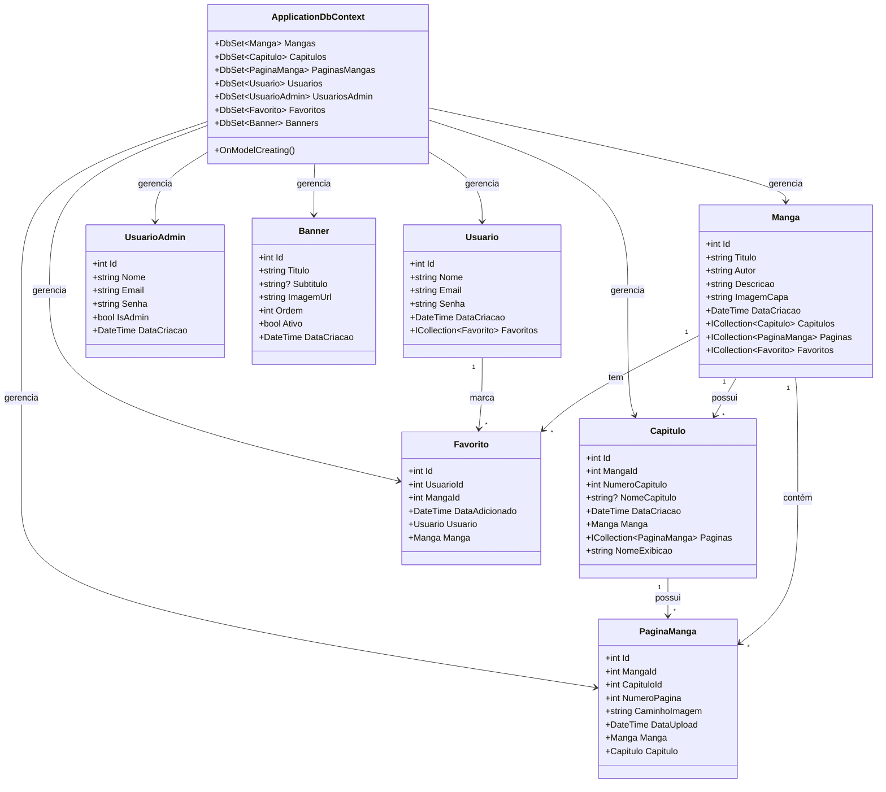

# Diagrama de Classes - AnyComic

Este diagrama representa a estrutura de classes do sistema AnyComic, mostrando as entidades principais e seus relacionamentos.

## Descrição dos Relacionamentos:

- **Manga -> Capitulo**: Um manga possui vários capítulos (1:N)
- **Manga -> PaginaManga**: Um manga contém várias páginas (1:N, Restrict delete)
- **Capitulo -> PaginaManga**: Um capítulo possui várias páginas (1:N, Cascade delete)
- **Manga -> Favorito**: Um manga pode estar nos favoritos de vários usuários (1:N)
- **Usuario -> Favorito**: Um usuário pode ter vários mangas favoritos (1:N)
- **ApplicationDbContext**: Gerencia todas as entidades através do Entity Framework Core

## Como visualizar este diagrama:

1. **GitHub/GitLab**: Visualize este arquivo diretamente no repositório
2. **Mermaid Live Editor**: https://mermaid.live/ (cole o código)
3. **VS Code**: Instale a extensão "Markdown Preview Mermaid Support"
